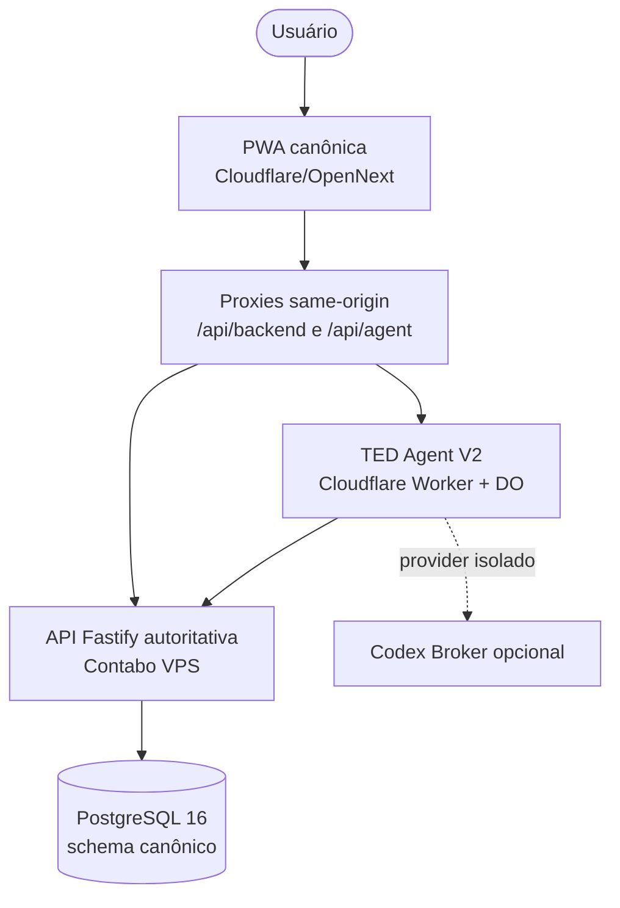

# Meu Ted — Arquitetura atual

**Last verified:** 2026-10-04
**Reference:** [`runtime-facts.json`](architecture/runtime-facts.json)

## Topologia implementada

## Responsabilidades e limites

- **API (`apps/api`):** única fonte da verdade financeira. Autentica,
  autoriza por workspace e aplica idempotência. Pending operations V2 são
  armazenadas e transitam aqui, vinculadas a `workspaceId`, `actorId` e
  `deviceId`; confirmação, execução, cancelamento, retry e expiração são
  rotas autoritativas com capability delegada específica.
- **PWA (`apps/pwa`):** aplica sessão e CSRF nos proxies same-origin. A
  autenticação online é session-first e cookie-only: o cookie de sessão é a
  autoridade e o token de dispositivo não substitui a sessão online. A UX do
  TED envia apenas uma decisão e um `requestId`; nunca envia/recebe
  atestação. Rotas V1 de aprovação direta não são utilizadas.
- **Autorização de mutações TED:** a confirmação humana é condicional, não
  universal. A policy determinística da API pode autoautorizar somente
  `transactions.expense.create` e `transactions.income.create` de baixo risco;
  o limiar de R$ 500 exige confirmação e operações destrutivas/incertas ficam
  sempre manuais. PendingOperation V2, idempotência e receipt permanecem
  inalterados. `TED_RISK_BASED_AUTOEXECUTE` aceita `off|shadow|on`, default
  `off`; kill switch = definir `off`. O modelo não concede autorização.
  Consulte [ADR-026](adr/ADR-026-risk-based-mutation-authorization.md) e
  [observabilidade](ops/ted-autoexecute-observability.md).
- **Agent (`apps/agent`):** todos os canais passam por
  `ConversationOrchestrator` e `TurnInput`. Router, evidências, resposta
  grounded, memória e observabilidade são internos. A SQLite do Durable
  Object contém apenas conversa/memória; não contém autoridade financeira.
- **MutationExecutor:** único consumidor/emissor de atestação no Agent e
  único cliente do ciclo de decisão V2. O provider/modelo não concede
  capability, aprovação ou write.
- **Codex Broker (`apps/codex-broker`):** container Node 22 non-root com
  healthcheck. Ele não possui acesso a PostgreSQL nem capability financeira.

## Segurança operacional

- Mutações financeiras exigem API autoritativa, capability estreita,
  binding de workspace/ator/dispositivo, PendingOperation válida e
  idempotência; a confirmação humana é exigida pela policy, salvo autoexecução
  low-risk explicitamente autorizada para a allowlist inicial.
- O sistema falha fechado se falta esquema, evidência, binding, capability,
  autorização técnica, receipt ou autoridade do provider.
- O Agent revalida a configuração/epoch do provider antes de publicar uma
  resposta; falha de upstream não produz sucesso sintético.
- O snapshot offline é V3: envelope com identidade opaca não-autenticadora
  (principal + workspace, vinculados somente após autenticação online
  confirmada pelo servidor), com migração V2→V3. A state machine de auth
  roteia `authenticated`→app, `unauthenticated`→login e
  `unreachable`→snapshot offline somente-leitura quando houver snapshot.
- Mutações keyed são fail-closed: com a transação de claim (`claimTx`)
  aberta, o efeito executa nessa transação; extensão `*InTx` ausente retorna
  o erro invariante `idempotency.atomic_mutation_not_supported`, nunca um
  fallback simples fora da claim.
- O CI exige `public-safety --strict` (warnings reprovam o gate) e os
  deploys verificam `head_repository` contra o repositório esperado,
  bloqueando execuções originadas de fork.
- A API web inicializa em modo verify-only. Migrations são executadas somente
  pelo job explícito documentado em `docs/runbooks/api-migration-v2.md`.

## Legado e estado de implantação

O `WorkspaceAgent` foi removido na V4 (ver
`docs/adr/ADR-016-workspace-agent-decommissioning.md`); não restam binding,
rota ou símbolo desse runtime — apenas a tag histórica de migração do
Durable Object no `wrangler.jsonc`, preservada por exigência da Cloudflare.
O WhatsApp Bridge e a extensão Pi foram removidos dos workspaces, CI e
runtime ativo. Na `main`, a imagem da API é publicada no GHCR por tag de
SHA com o digest imutável registrado como saída do job, e o manifesto do
Agent exige `lockfileHash` + `wranglerVersion` (deploy sem manifesto
completo é recusado). A implementação V2 está em produção e verificada em 2026-10-01: a API na VPS
rodava `29c015d` (build `36900550367`, `/health` + `/ready` 200, rollback tag
e release manifest preservados) e a PWA/Agent na Cloudflare rodavam `06c00c2`
(build `36896164604`), com live closure E2E PASS em produção
([relatório](reports/2026-10-01-acceptance-closure.md)).

## Dados e esquema

- A API de produção serve o esquema canônico (`DB_SCHEMA=canonical`, banco
  `pi_financeiro_canonical`); o banco legacy (`pi_financeiro`) permanece como
  archive intocado.
- O repair de âncoras foi commitado em produção (`repair_committed=2`,
  `repair_compensated=0`) com residual zero sobre 32 contas vivas; a
  reconciliação canônica roda com `--provenance=fresh`
  (`checked=37 drifted=0`).
- O uso de bearer legado é registrado em sink durável em `audit_logs`
  (`auth.request.legacy_bearer_used`, PRs #51/#52); a janela Release B foi
  **reiniciada** no corte para a VPS Contabo — contagem a partir de
  2026-10-02T21:36:06Z (115 eventos, idênticos nas duas origens), fechando em
  **2026-10-16T21:36:06Z** ([`reports/2026-10-03-vps-migration-contabo.md`](reports/2026-10-03-vps-migration-contabo.md)).
  O flip (`SESSION_BEARER_FALLBACK_ENABLED=off` + rebuild do PWA com
  `NEXT_PUBLIC_LEGACY_BEARER_COMPAT=off`) permanece gate humano.
