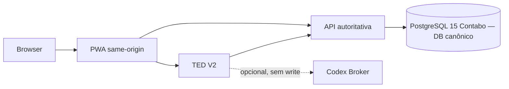

# Meu Ted — Arquitetura alvo

**Last verified:** 2026-10-07
**Reference:** [`runtime-facts.json`](architecture/runtime-facts.json)

## Estado alvo consolidado

O destino do projeto é uma superfície única composta por PWA, API autoritativa
e TED Agent V2. O browser fala apenas com a origem da PWA; a API da VPS segue
como única autoridade financeira. Não há runtime WhatsApp/Bridge nem extensão
Pi como caminho operacional. O alvo inclui a base canônica única: a API serve
apenas `pi_financeiro_canonical` e o banco legacy existe somente como archive
histórico até a aposentadoria formal. Após o flip da Release B não há
compatibilidade de bearer legado (`SESSION_BEARER_FALLBACK_ENABLED=off`).

## Propriedades de convergência

1. Um `ConversationOrchestrator` normaliza REST, SDK e Broker em um contrato
   único e fail-closed.
2. Respostas financeiras usam evidência atual da API; memória só fornece
   contexto não autoritativo.
3. Provedores são adaptadores de texto/ferramenta e nunca são uma fonte de
   identidade, capability, aprovação ou valor financeiro.
4. Uma mutação passa por PendingOperation V2 e execução idempotente na API.
   Confirmação humana é condicional: policy determinística autoriza apenas a
   allowlist `transactions.{expense,income}.create` de baixo risco; R$ 500 ou
   mais e operações destrutivas/incertas permanecem manuais. Receipt e
   autoridade canônica da API não mudam; a PWA recebe apenas DTOs seguros de
   estado. `TED_RISK_BASED_AUTOEXECUTE` (`off|shadow|on`) fica `off` por padrão,
   com `off` como kill switch.
5. CI executa API, Agent, Broker, PWA, Postgres descartável, containers,
   segurança, documentação e invariantes arquiteturais. Deploys PWA/Agent só
   são elegíveis após conclusão `success` do workflow `CI` no SHA aprovado.

## Rollout e rollback

O rollout começa por fixtures e CI, seguido de leituras e propostas. Execução
confirmada requer auditoria e métricas operacionais. O rollback só pode alterar
roteamento de leitura ou versão de aplicação; migrations V2 permanecem
compatíveis e pending operations V2 continuam canceláveis/expiráveis. Nenhum
rollback pode reintroduzir `[EXEC_ACTION]`, atestação no browser ou write sem
confirmação.
